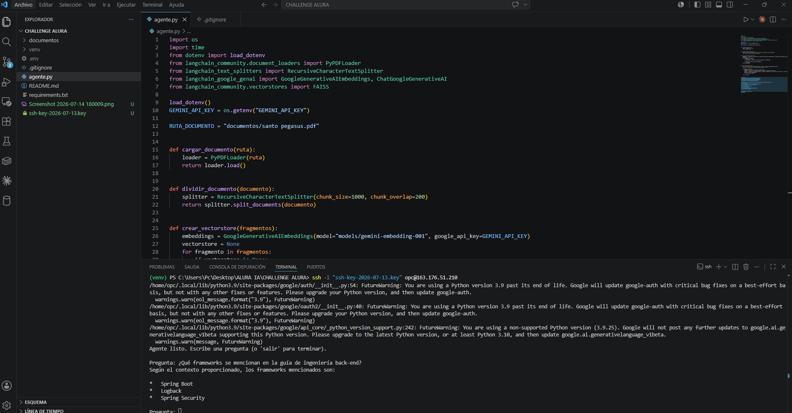

# Agente Inteligente - Santos Pegasus Soluciones

Agente de inteligencia artificial que responde preguntas sobre la Guía Oficial de Ingeniería Back-end de Santos Pegasus Soluciones, una empresa ficticia de tecnología especializada en microservicios e IA.

Este proyecto fue desarrollado como parte del Challenge Alura Agente.

## Descripción del proyecto

El agente lee un documento PDF con las normas técnicas de ingeniería back-end de la empresa y permite hacer preguntas en lenguaje natural sobre su contenido, devolviendo respuestas basadas únicamente en la información del documento.

## Arquitectura

El proyecto sigue una arquitectura RAG (Retrieval-Augmented Generation):

1. **Carga del documento**: se lee el PDF usando PyPDFLoader.
2. **División en fragmentos**: el texto se divide en fragmentos de 1000 caracteres con 200 de superposición, usando RecursiveCharacterTextSplitter.
3. **Generación de embeddings**: cada fragmento se convierte en un vector numérico con el modelo gemini-embedding-001 de Google.
4. **Almacenamiento vectorial**: los vectores se guardan en una base FAISS para poder buscar los fragmentos más relevantes según la pregunta.
5. **Generación de respuesta**: al recibir una pregunta, se buscan los fragmentos más relevantes y se le pasan como contexto al modelo gemini-2.5-flash, que genera la respuesta final.

## Tecnologías utilizadas

- Python
- LangChain
- FAISS (faiss-cpu)
- Google Gemini API (gemini-embedding-001 y gemini-2.5-flash)
- python-dotenv

## Estructura del proyecto

CHALLENGE ALURA/
├── documentos/
│   └── santo pegasus.pdf
├── agente.py
├── requirements.txt
├── .env
└── .gitignore
## Instrucciones para ejecutar el proyecto

1. Clonar el repositorio: 
git clone https://github.com/dixonroque27/alura-agente-santos-pegasus.git

2. Crear y activar un entorno virtual:
python -m venv venv
venv\Scripts\activate

3. Instalar las dependencias:
pip install -r requirements.txt

4. Crear un archivo `.env` en la raíz del proyecto con tu clave de la API de Gemini:
GEMINI_API_KEY=tu_clave_aqui

5. Ejecutar el agente:
python agente.py

6. Escribir preguntas cuando el programa lo indique. Para salir, escribir `salir`. Guarda (Ctrl + S).
## Ejemplos de preguntas y respuestas

**Pregunta:** ¿Qué frameworks se mencionan en la guía de ingeniería back-end?

**Respuesta:** Según el contexto proporcionado, los frameworks mencionados son Logback, Spring Boot y Spring Security.

**Pregunta:** ¿Qué buenas prácticas de documentación de API se recomiendan?

**Respuesta:** Las buenas prácticas recomendadas son documentar las APIs usando la especificación OpenAPI (Swagger), generar la documentación automáticamente a partir del código utilizando springdoc-openapi, y exponer claramente los endpoints.

**Pregunta:** ¿Qué estándares de seguridad se deben seguir?

**Respuesta:** Se debe gestionar el control de acceso a las APIs con Spring Security, adoptar tokens JWT basados en OAuth 2.0 u OpenID Connect, utilizar Bean Validation para validar los datos de entrada y realizar sanitización de cadenas de texto.
## Deploy en la nube

El agente fue desplegado en una instancia de máquina virtual (VM.Standard.E2.1.Micro, Always Free) en Oracle Cloud Infrastructure (OCI), región Brasil Este (São Paulo).

**IP pública de la instancia:** 163.176.51.210

El despliegue se realizó siguiendo estos pasos:

1. Creación de una VCN (Virtual Cloud Network) con subnet pública e Internet Gateway.
2. Creación de una instancia de cómputo con Oracle Linux 9.
3. Conexión por SSH a la instancia.
4. Instalación de Git, Python pip y las dependencias del proyecto.
5. Clonado del repositorio directamente desde GitHub.
6. Configuración del archivo .env con la clave de API.
7. Ejecución del agente (python3 agente.py) directamente en el servidor.

A continuación, evidencia del agente ejecutándose en la instancia de OCI:

